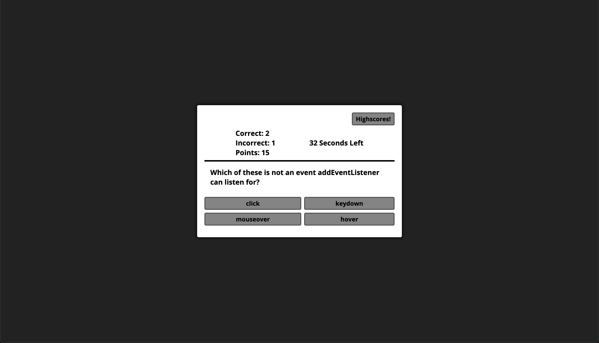
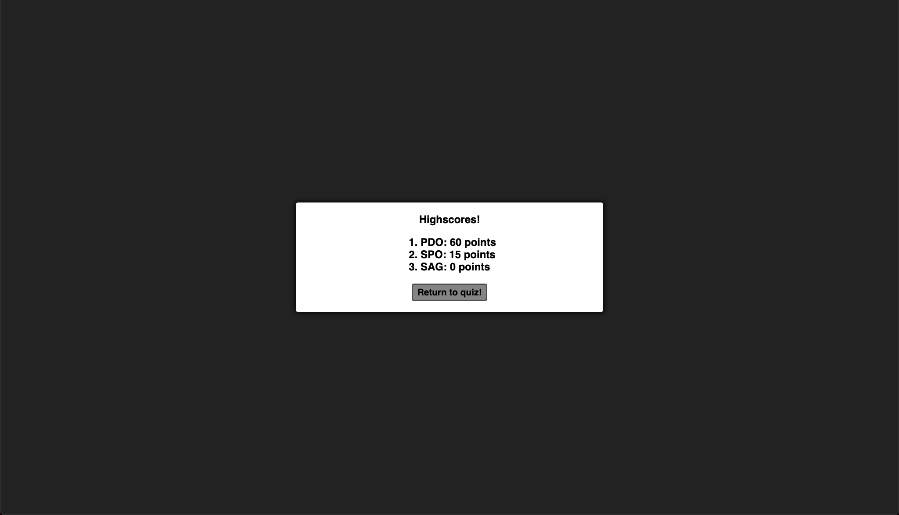

# Password Generator

## Summary

The goal of this project was to create a web based quiz with questions focusing on Javascript in order to reinforce Javascript fundamentals.

---

## Details

* 60 second timed quiz. Incorrect answers reduce time left.
* Points system in place: Correct answer +10 points. Incorrect answer -5 points.
* User can save their score when they complete all questions or the timer runs out.
* Highscores list stored in localstorage and displayed on a second page.

---

---

## Live Site

Link to the live site [here.](https://seanovery.github.io/password-generator/)

---

## Preview

